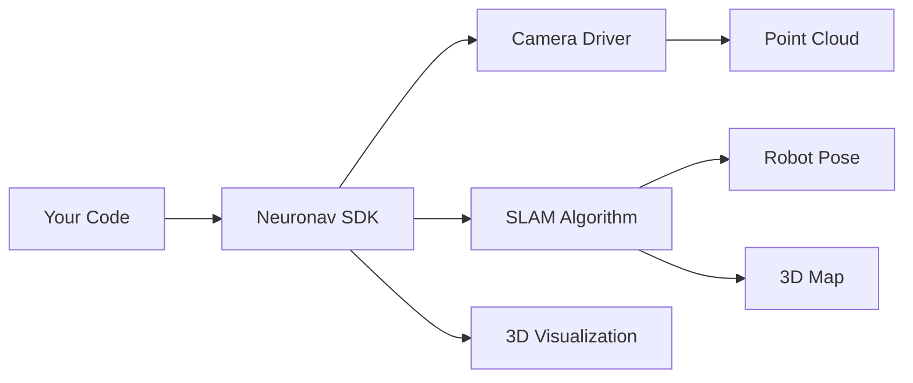

Neuronav SLAM SDK is a Python library that makes SLAM (Simultaneous Localization and Mapping) accessible to everyone. We handle the complexity of ROS2, sensor drivers, and SLAM algorithms so you can focus on building your application.

## 2-Line Simplicity

<CardGroup cols={1}>
  <Card title="That's All You Need" icon="code">
    ```python
    sensor = RealSenseSensor()
    run_slam(sensor, RTABMapSLAM())
    ```
  </Card>
</CardGroup>

<CardGroup cols={2}>
  <Card title="Production Ready" icon="rocket">
    Built on battle-tested RTAB-Map with loop closure and global optimization
  </Card>

  <Card title="Multiple Sensors" icon="camera">
    Intel RealSense and OAK-D Pro cameras supported out of the box
  </Card>
</CardGroup>

## Traditional SLAM vs Neuronav SDK

| Traditional SLAM | Neuronav SDK |
|------------------|--------------|
| Install and configure ROS2 ❌ | Install SDK ✅ |
| Set up camera drivers ❌ | Run 2 lines of code ✅ |
| Configure SLAM parameters ❌ | |
| Handle topic remapping ❌ | |
| Manage process lifecycle ❌ | |
| **Time to first map: Days** | **Time to first map: 2 minutes** |

## How It Works



## Use Cases

- **Autonomous Navigation** - Mobile robots that need to map and navigate
- **Drone Mapping** - Create 3D maps of buildings and environments
- **AR/VR Tracking** - Track headset position in 3D space
- **3D Reconstruction** - Scan objects and environments
- **Research** - Quickly prototype SLAM applications

## Supported Hardware

**Depth Cameras**
- Intel RealSense D435i, D455, D415
- Luxonis OAK-D Pro, OAK-D Pro W
- [Add your own sensor](/sensors/custom-sensors) in under 20 minutes

**Computing Platforms**
- Ubuntu 20.04/22.04
- Docker containers

## Get Started

<CardGroup cols={3}>
  <Card title="Quick Start" icon="play" href="/getting-started/quickstart">
    Run SLAM in 2 minutes
  </Card>

  <Card title="Installation" icon="download" href="/getting-started/installation">
    Detailed setup guide
  </Card>

  <Card title="Examples" icon="code" href="/examples/basic-slam">
    Code examples
  </Card>
</CardGroup>