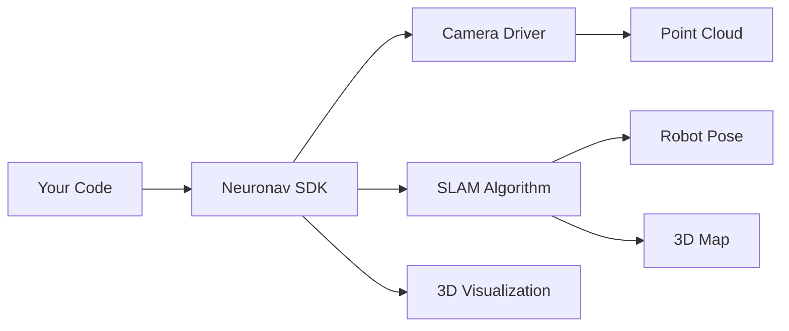

Build real-time 3D mapping and localization into your robotics projects with just 2 lines of Python code.

## What is Neuronav SDK?

Neuronav SDK is a Python library that makes SLAM (Simultaneous Localization and Mapping) accessible to everyone. We handle the complexity of ROS2, sensor drivers, and SLAM algorithms so you can focus on building your application.

## Key Features

<CardGroup cols={1}>
  <Card title="2-Line Simplicity" icon="code">
    ```python
    sensor = RealSenseSensor()
    run_slam(sensor, RTABMapSLAM())
    ```
    That's all you need!
  </Card>
</CardGroup>

<CardGroup cols={2}>
  <Card title="Production Ready" icon="rocket">
    Built on battle-tested RTAB-Map algorithm with loop closure and global optimization
  </Card>

  <Card title="Multiple Sensors" icon="camera">
    Supports Intel RealSense and OAK-D Pro cameras out of the box
  </Card>
</CardGroup>

## Why Neuronav SDK?

### Traditional SLAM Setup
- Install and configure ROS2 ❌
- Set up camera drivers ❌
- Configure SLAM parameters ❌
- Handle topic remapping ❌
- Manage process lifecycle ❌
- **Time to first map: Days or weeks**

### With Neuronav SDK
- Install SDK ✅
- Run 2 lines of code ✅
- **Time to first map: 2 minutes**

## How It Works



## Use Cases

- **Autonomous Navigation**: Mobile robots that need to map and navigate
- **Drone Mapping**: Create 3D maps of buildings and environments
- **AR/VR Tracking**: Track headset position in 3D space
- **3D Reconstruction**: Scan objects and environments
- **Research**: Quickly prototype SLAM applications

## System Architecture

The SDK provides a clean abstraction over complex systems:

| Layer | Responsibility |
|-------|---------------|
| **Your Application** | Business logic |
| **Neuronav SDK** | API and orchestration |
| **Sensor Drivers** | Camera interfaces |
| **SLAM Algorithms** | Mapping and localization |
| **ROS2** | Inter-process communication |

## Supported Hardware

### Depth Cameras
- Intel RealSense D435i, D455, D415
- Luxonis OAK-D Pro, OAK-D Pro W
- Easy to add new sensors (< 20 minutes)

### Computing Platforms
- Desktop/Laptop (Ubuntu 20.04/22.04)
- NVIDIA Jetson (Nano, Xavier, Orin)
- Raspberry Pi 4/5 (with limitations)
- Docker containers

## What's Included

- **Core SDK**: Simple Python API
- **Docker Support**: Pre-configured containers
- **Example Code**: Ready-to-run scripts
- **Debug Tools**: Troubleshooting utilities
- **Documentation**: Comprehensive guides

## Quick Example

Here's a complete SLAM application:

```python
from neuronav import RealSenseSensor, run_slam, RTABMapSLAM

# Configure sensor (optional)
sensor = RealSenseSensor()

# Configure SLAM (optional)
slam = RTABMapSLAM()

# Run SLAM with visualization
run_slam(sensor, slam, visualize=True)

# That's it! Your robot is now mapping in 3D
```

## Next Steps

<CardGroup cols={2}>
  <Card title="Quick Start" icon="play" href="/getting-started/quickstart">
    Get up and running in 2 minutes
  </Card>

  <Card title="Installation" icon="download" href="/getting-started/installation">
    Detailed installation guide
  </Card>

  <Card title="Examples" icon="code" href="/examples/basic-slam">
    See code examples
  </Card>
</CardGroup>

## Community & Support

- **GitHub**: [github.com/neuronav/neuronav-slam-sdk](https://github.com/neuronav/neuronav-slam-sdk)
- **Issues**: [Report bugs or request features](https://github.com/neuronav/neuronav-slam-sdk/issues)
- **Email**: support@neuronav.com

Ready to add SLAM to your project? Continue to the [Quick Start](/getting-started/quickstart) guide!